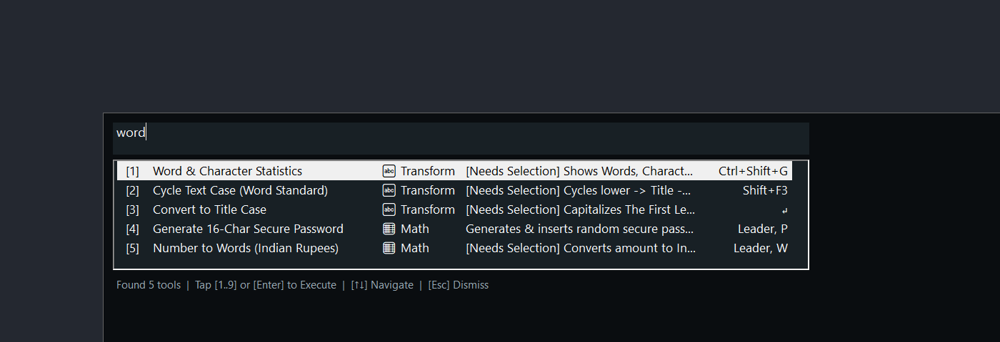
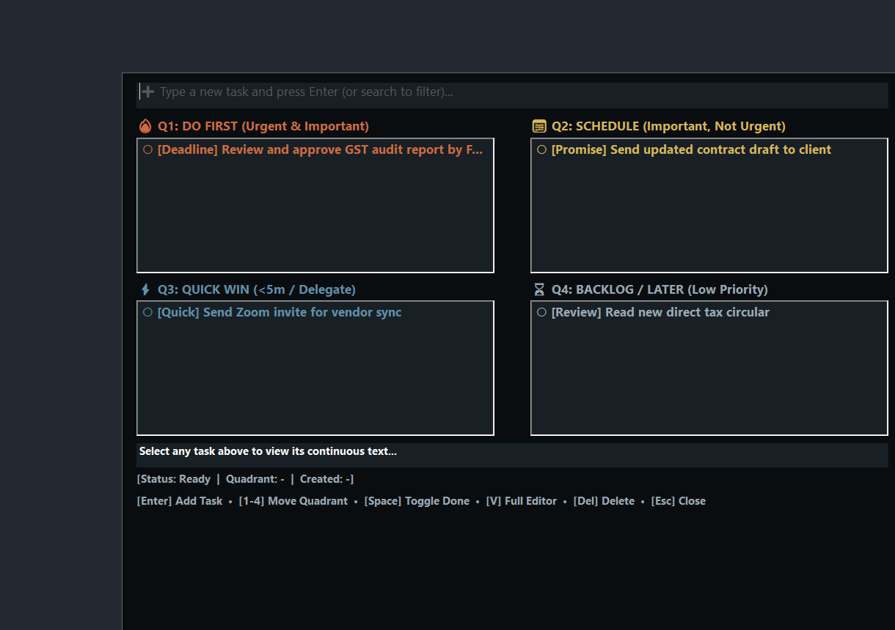

# Office Productivity Palette

Office Productivity Palette is a Windows 10/11 productivity hub that brings a searchable command palette, a four-quadrant action board, snippet and task capture, office-oriented text tools, and keyboard shortcuts into one direct-use application.

## Download

> **Publication status:** Release publication is pending user approval during local review. The executable is not claimed to be available yet.

After publication, open this repository's **Releases** page, choose **v2.0.0**, and download:

`office_productivity_palette_v2.0.0.exe`

The release will be distributed as a standalone executable, not an installer. See [Security verification](#security-verification) before launching it.

## What it does

- Searches and runs office-focused tools from a universal command palette.
- Captures selected text as tasks or reusable snippets.
- Organizes tasks on an Eisenhower-style action board with Do First, Schedule, Quick Win, and Backlog quadrants.
- Provides selection-based text transformation, word and character statistics, find and replace, date/time insertion, math, conversion, extraction, email-template, and utility workflows.
- Repeats the last action and supports a leader-key workflow for frequently used tools.

For the approved intent and behavior of the tool catalog, see the [all-tools intention document](docs/USER_INTENTION_ALL_TOOLS_2026-08-29.md).

## Screenshots



*The command palette filters office tools and shows their categories, selection requirements, and shortcuts.*



*The action board organizes example tasks into four priority quadrants.*


*A representative command-palette result evaluating `2^8` as `256.00`.*

## Requirements

- **EXE users:** Windows 10 or Windows 11. AutoHotkey is not required to run the published executable.
- **Source reviewers:** AutoHotkey v2 is required to examine the source in its intended language environment. The published subset is incomplete and cannot be run independently; see [Published source scope](#published-source-scope).

No compatibility is claimed for other operating systems or AutoHotkey v1.

## Install and run

1. After release publication, open the repository's Releases page and select **v2.0.0**.
2. Download `office_productivity_palette_v2.0.0.exe` from the release assets.
3. Optionally—but preferably—verify the SHA-256 checksum below.
4. Launch the executable. No installer step is required.

Windows may show its normal security warning for a downloaded executable. Check that the filename and SHA-256 match this README, review the prompt, and proceed only if you trust the file. This project does not claim that the binary is code-signed.

## Core shortcuts

These bindings are verified from the published main source. Actions that capture or transform text require a selection. The final four Word-parity shortcuts are intentionally inactive while Microsoft Word is the active application.

| Shortcut | Action | Context |
|---|---|---|
| Double-tap `Shift` | Open the universal command palette | Tap left or right Shift twice in quick succession. |
| `Ctrl+Space` | Open the command palette | Fallback palette shortcut. |
| Double-tap `Ctrl` | Capture selected text as a task | Requires selected text; tap left or right Ctrl twice in quick succession. |
| `Win+T` or `Win+Shift+T` | Toggle the action board | Global. |
| `Ctrl+Shift+T` | Capture selected text as a task | Requires selected text. |
| `Ctrl+Shift+H` | Save selected text as a snippet | Requires selected text. |
| `Ctrl+Shift+U` | Open the civil and construction converter | Global. |
| `Win+Esc` | Open the snippet manager | Global. |
| `Ctrl+H` or `F12` | Open in-selection find and replace | Operates on selected text. |
| `Win+0` or `Ctrl+0` | Repeat the last action | Requires a previously repeatable action. |
| `Win+Shift+;` or `Win+Shift+Space` | Activate the leader key | Starts the leader-key workflow. |
| `Alt+Shift+D` | Insert the current ISO date | Active outside Microsoft Word. |
| `Alt+Shift+T` | Insert the current 12-hour time | Active outside Microsoft Word. |
| `Ctrl+Shift+G` | Show word and character statistics | Requires selected text; active outside Microsoft Word. |
| `Shift+F3` | Cycle selected-text case | Requires selected text; active outside Microsoft Word. |

`Esc` dismisses visible Office Productivity Palette interfaces when one is open.

## Published source scope

> **Important:** This repository publishes a limited subset of six selected AutoHotkey files. It is **not the complete application source**, is **not independently runnable or rebuildable**, and **cannot reproduce the EXE**.

The main script declares 28 includes, of which 23 are absent or excluded from the public subset. The executable is audited as a separate binary artifact. Review the [public audit](docs/PUBLIC_AUDIT.md) for the exact inventory, include coverage, hashes, evidence, and limitations.

## Documentation and audit

- [Approved intent for all tools](docs/USER_INTENTION_ALL_TOOLS_2026-08-29.md)
- [Public audit for v2.0.0](docs/PUBLIC_AUDIT.md)
- [Release notes for v2.0.0](release/RELEASE_NOTES_v2.0.0.md)

## Security verification

From PowerShell in the folder containing the downloaded executable, run:

```powershell
Get-FileHash -Algorithm SHA256 -LiteralPath .\office_productivity_palette_v2.0.0.exe
```

Expected SHA-256:

```text
1D51880EAEEDE855A139FB3C215882EC1138E101DDA1843963AF918EC728CCE7
```

If the computed hash differs, do not use the file as the audited v2.0.0 artifact.

## Troubleshooting

- **A selection action does nothing:** Highlight text first, then retry the capture, statistics, case, or find-and-replace action.
- **A Word-style shortcut does nothing in Microsoft Word:** This is intentional. Date, time, statistics, and case-cycling parity shortcuts are disabled while `WINWORD.EXE` is active so Word can keep its native behavior.
- **The double-tap shortcut does not open or capture:** Tap the same modifier twice promptly without pressing another key, or use `Ctrl+Space` for the palette and `Ctrl+Shift+T` for task capture.
- **A window remains open:** Press `Esc` while an Office Productivity Palette interface is visible.
- **The source does not start:** The published source is an audited limited subset with missing dependencies; use the released EXE after publication for direct use.
- **Windows warns about the download:** Confirm the exact filename and checksum above, then decide whether to run it. No code-signing claim is made.

## License

The project owner licenses the files published in this repository under the GNU General Public License v3.0 or later (**GPL-3.0-or-later**). See [LICENSE](LICENSE) for the complete terms.
